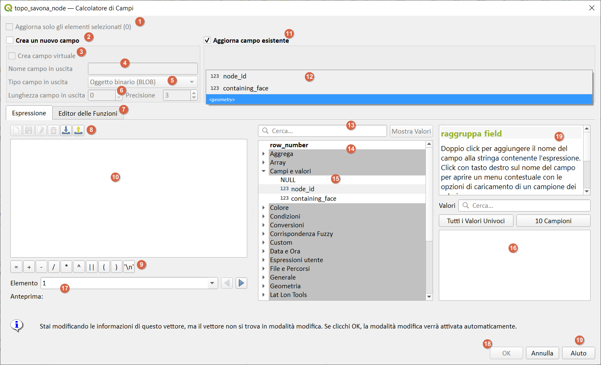

# Interfaccia calcolatore di campi

1. se attivato aggiorna solo le geometrie selezionate (indica anche il numero delle feature selezionate);
2. se attivato crea un nuovo campo;
3. se attivato crea un campo virtuale;
4. permette di digitare nome del campo (per shapefile NON più di 10 caratteri);
5. permette di selezionare il Tipo di campo in uscita;
6. permette di digitare la Lunghezzacampo in uscita e relativa precisione in caso di numeri Reali;
7. permette di accedere al tab Editor delle Funzioni personalizzate (occorre conoscere il linguaggio Python);
8. icone che permettono di:
   1.  cancellare l'editor delle espressioni;
   2.  salvare le espressioni utente;
   3.  modificare le espressioni utente salvate;
   4.  cancellare le espressioni utente salvate;
   5.  importa espressioni utente;
   6.  esporta funzioni utente.
9. operatori più usati:
   1. `=` uguale;
   2. `+` somma;
   3. `-` differenza;
   4. `/` divisione;
   5. `*` moltiplicazione;
   6. `^` potenza;
   7. `||` unione stringhe (doppio pipe);
   8. `()` parentesi;
   9. `'\n'`nuova riga;
10. editore delle espressioni;
11. se attivato aggiorna campo esistente (anche la geometria);
12. elenco di tutti i campi aggiornabili relativi al layer selezionato;
13. permette di cercare le funzioni, il bottone `Mostra Guida` permette di abilitare l'area dell'Help;
14. area dei gruppi funzione;
15. gruppo Campi e valori relativi al layer selezionato;
16. permette di visualizzare i valori dei campi presenti nel gruppo Campi e valori;
17. permette di selezionare l'Elemento per cui visualizzare l'Anteprima;
18. tasto OK per applicare l'espressione;
19. Help sulla funzione selezionata.

## Commenti per documentare espressione

È possibile aggiungere commenti alle espressioni nell'area dell'editor espressioni:
1. per riga intera `/*commento*/`
2. per commentare una riga `--commento`

## Interfaccia calcolatore di campi e finestre nascoste

Nel caso risulti nascosta la sezione Gruppi funzioni (vale fino alla QGIS 3.4):

Nel caso risulti nascosta la sezione help in linea:

Per aumentare dimensione caratteri:

