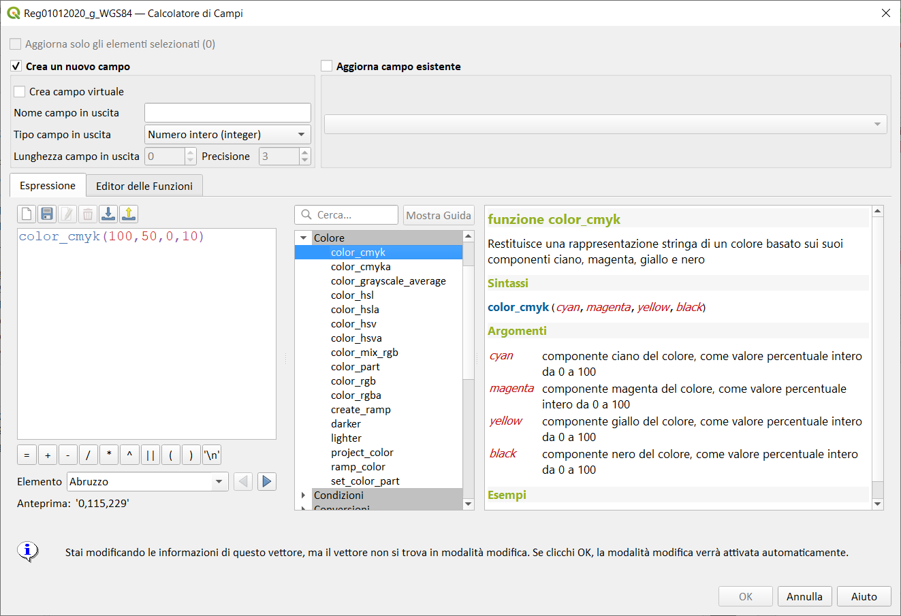
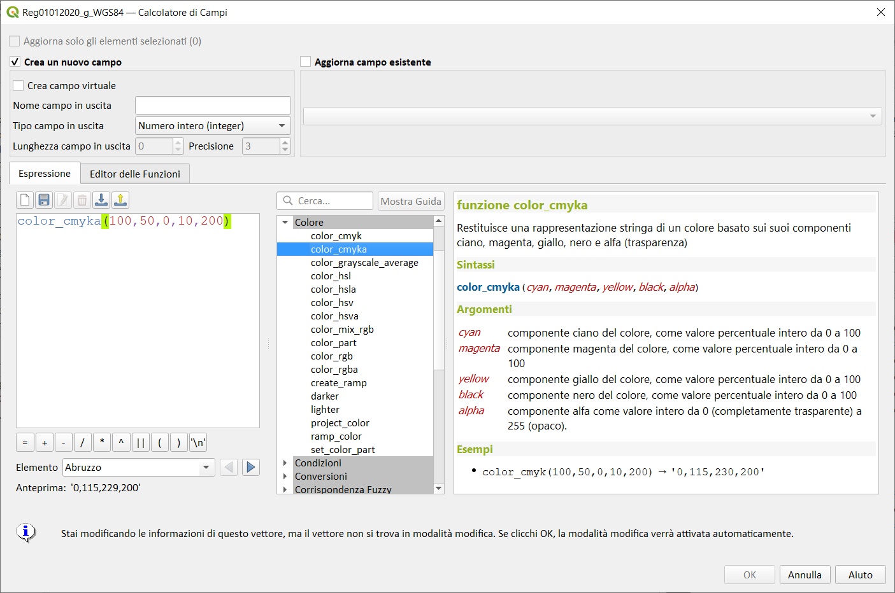
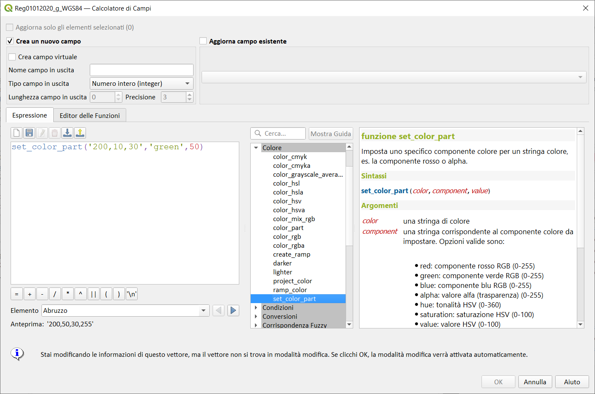

# Gruppo Colore

!!! Abstract
    **Questo gruppo contiene funzioni per manipolare i colori**

---

## color_cmyk

Restituisce una rappresentazione stringa di un colore basato sui suoi componenti ciano, magenta, giallo e nero

Sintassi:

- color_cmyk(_<span style="color:red;">cyan</span>_, _<span style="color:red;">magenta</span>_, _<span style="color:red;">yellow</span>_, _<span style="color:red;">black</span>_)

Argomenti:

* _<span style="color:red;">cyan</span>_ componente ciano del colore, come valore percentuale intero da 0 a 100
* _<span style="color:red;">magenta</span>_ componente magenta del colore, come valore percentuale intero da 0 a 100
* _<span style="color:red;">yellow</span>_ componente giallo del colore, come valore percentuale intero da 0 a 100
* _<span style="color:red;">black</span>_ componente nero del colore, come valore percentuale intero da 0 a 100

Esempi:

```
color_cmyk(100,50,0,10) → 0,115,230
```



osservazioni:

```
color_cmyk(100,50,0,10) = color_rgb( 0,115,230 )
```

---

## color_cmyka

Restituisce una rappresentazione stringa di un colore basato sui suoi componenti ciano, magenta, giallo, nero e alfa (trasparenza)

Sintassi:

- color_cmyka(_<span style="color:red;">cyan</span>_, _<span style="color:red;">magenta</span>_, _<span style="color:red;">yellow</span>_, _<span style="color:red;">black</span>_, _<span style="color:red;">alpha</span>_)

Argomenti:

* _<span style="color:red;">cyan</span>_ componente ciano del colore, come valore percentuale intero da 0 a 100
* _<span style="color:red;">magenta</span>_ componente magenta del colore, come valore percentuale intero da 0 a 100
* _<span style="color:red;">yellow</span>_ componente giallo del colore, come valore percentuale intero da 0 a 100
* _<span style="color:red;">black</span>_ componente nero del colore, come valore percentuale intero da 0 a 100
* _<span style="color:red;">alpha</span>_ componente alfa come valore intero da 0 (completamente trasparente) a 255 (opaco).

Esempi:

```
color_cmyka(100,50,0,10,200) → '0,115,229,200'
```



osservazioni:

```
color_cmyka(100,50,0,10,200) = color_rgba(0,115,230,200)`
```

---

## color_grayscale_average

Applica un filtro in scala di grigio e restituisce una rappresentazione di stringa da un colore fornito.

Sintassi:

- color_grayscale_average(_<span style="color:red;">color</span>_)

Argomenti:

* _<span style="color:red;">color</span>_ una stringa di colore

Esempi:

```
color_grayscale_average('255,100,50') → '135,135,135,255'
```


---

## color_hsl

Restituisce una rappresentazione stringa di un colore basato sui suoi attributi tonalità, saturazione e luminosità.

Sintassi:

- color_hsl(_<span style="color:red;">hue</span>_, _<span style="color:red;">saturation</span>_, _<span style="color:red;">lightness</span>_)

Argomenti:

* _<span style="color:red;">hue</span>_ tonalità del colore, come valore intero da 0 a 360
* _<span style="color:red;">saturation</span>_ percentuale di saturazione del colore come valore intero da 0 a 100
* _<span style="color:red;">_<span style="color:red;">lightness</span>_/span>_ percentuale di luminosità de</span>_ colore come valore intero da 0 a 100

Esempi:

```
color_hsl(100,50,70) → 166,217,140
```


osservazioni:

```
color_hsl(100,50,70) =  color_rgb( 166,217,140)
```

---

## color_hsla

Restituisce una rappresentazione stringa di un colore basato sui suoi attributi tonalità, saturazione, luminosità e alfa (trasparenza)

Sintassi:

- color_hsl(_<span style="color:red;">hue</span>_, _<span style="color:red;">saturation</span>_, _<span style="color:red;">lightness</span>_, _<span style="color:red;">alpha</span>_)

Argomenti:

* _<span style="color:red;">hue</span>_ tonalità del colore, come valore intero da 0 a 360
* _<span style="color:red;">saturation</span>_ percentuale di saturazione del colore come valore intero da 0 a 100
* _<span style="color:red;">lightness</span>_ percentuale di luminosità del colore come valore intero da 0 a 100
* _<span style="color:red;">alpha</span>_ componente alfa come valore intero da 0 (completamente trasparente) a 255 (opaco).

Esempi:

```
color_hsla(100,50,70,200) → '166,217,140,200'
```


osservazioni:

```
color_hsla(100,50,70,200) =  color_rgba( 166,217,140,200)
```

---

## color_hsv

Restituisce una rappresentazione stringa di un colore basato sui suoi attributi tonalità, saturazione e valore.

Sintassi:

- color_hsv(_<span style="color:red;">hue</span>_, _<span style="color:red;">saturation</span>_, _<span style="color:red;">value</span>_)

Argomenti:

* _<span style="color:red;">hue</span>_ tonalità del colore, come valore intero da 0 a 360
* _<span style="color:red;">saturation</span>_ percentuale di saturazione del colore come valore intero da 0 a 100
* _<span style="color:red;">value</span>_ valore percentuale del colore come intero da 0 a 100

Esempi:

```
color_hsv(40,100,100) → '255,170,0'
```


osservazioni:

```
color_hsv(40,100,100) =  color_rgb( 255,170,0 )
```

---

## color_hsva

Restituisce una rappresentazione stringa di un colore basato sui suoi attributi tonalità, saturazione, valore e alfa (trasparenza).

Sintassi:

- color_hsva(_<span style="color:red;">hue</span>_, _<span style="color:red;">saturation</span>_, _<span style="color:red;">value</span>_, _<span style="color:red;">alpha</span>_)

Argomenti:

* _<span style="color:red;">hue</span>_ tonalità del colore, come valore intero da 0 a 360
* _<span style="color:red;">saturation</span>_ percentuale di saturazione del colore come valore intero da 0 a 100
* _<span style="color:red;">value</span>_ valore percentuale del colore come intero da 0 a 100
* _<span style="color:red;">alpha</span>_ componente alfa come valore intero da 0 (completamente trasparente) a 255 (opaco)

Esempi:

```
color_hsva(40,100,100,200) → '255,170,0,200'
```


osservazioni:

```
color_hsva(40,100,100,200) = color_rgba( 255,170,0,200 )
```

---

## color_mix_rgb

Restituisce una stringa che rappresenta un colore che mescola i valori rosso, verde, blu e alfa di due colori forniti in base a un determinato rapporto.

Sintassi:

- color_mix_rgb(_<span style="color:red;">color1</span>_,_<span style="color:red;">color2</span>_,_<span style="color:red;">ratio</span>_)

Argomenti:

* _<span style="color:red;">color1</span>_ una stringa di colore
* _<span style="color:red;">color2</span>_ una stringa di colore
* _<span style="color:red;">ratio</span>_ un rapporto

Esempi:

```
color_mix_rgb('0,0,0','255,255,255',0.5) → 127,127,127,255
```


---

## color_part

Restituisce uno specifico componente colore da una stringa colore, es. la componente rosso o alfa.

Sintassi:

- color_part(_<span style="color:red;">color</span>_, _<span style="color:red;">component</span>_)

Argomenti:

* _<span style="color:red;">color</span>_ una stringa di colore
* _<span style="color:red;">component</span>_ una stringa corrispondente al componente colore da restituire. Opzioni valide sono:

    * red: componente rosso RGB (0-255)
    * green: componente verde RGB (0-255)
    * blue: componente blu RGB (0-255)
    * alpha: valore alfa (trasparenza) (0-255)
    * hue: tonalità HSV (0-360)
    * saturation: saturazione HSV (0-100)
    * value: valore HSV (0-100)
    * hsl_hue: tonalità HSL (0-360)
    * hsl_saturation: saturazione HSL (0-100)
    * lightness: luminosità HSL (0-100)
    * cyan: componente ciano CMYK (0-100)
    * magenta: componente magenta CMYK (0-100)
    * yellow: componente giallo CMYK (0-100)
    * black: componente nero CMYK (0-100)

Esempi:

```
color_part('200,10,30','green') → 10
```


---

## color_rgb

Restituisce una rappresentazione stringa di un colore basato sui suoi componenti rosso, verde e blu.

Sintassi:

- color_rgb(_<span style="color:red;">red</span>_, _<span style="color:red;">green</span>_, _<span style="color:red;">blue</span>_)

Argomenti:

* _<span style="color:red;">red</span>_ componente rosso del colore, come valore intero da 0 a 255
* _<span style="color:red;">green</span>_ componente verde del colore, come valore intero da 0 a 255
* _<span style="color:red;">blue</span>_ componente blu del colore, come valore intero da 0 a 255

Esempi:

```
color_rgb(255,127,0) → 255,127,0
```


---

## color_rgba

Restituisce una rappresentazione stringa di un colore basato sui suoi componenti rosso, verde, blue ed alpha (trasparenza).

Sintassi:

- color_rgba(_<span style="color:red;">red</span>_, _<span style="color:red;">green</span>_, _<span style="color:red;">blue</span>_,_<span style="color:red;">alpha</span>_)

Argomenti:

* _<span style="color:red;">red</span>_ componente rosso del colore, come valore intero da 0 a 255
* _<span style="color:red;">green</span>_ componente verde del colore, come valore intero da 0 a 255
* _<span style="color:red;">blue</span>_ componente blu del colore, come valore intero da 0 a 255
* _<span style="color:red;">alpha</span>_ componente alfa come valore intero da 0 (completamente trasparente) a 255 (opaco).

Esempi:

```
color_rgba(255,127,0,200) → '255,127,0,200'
```


---

## create_ramp

Restituisce una scala di colori a gradiente per una mappa di colori e passi.

Sintassi:

- create_ramp(_<span style="color:red;">map</span>_[,_<span style="color:red;">discrete=false</span>_])

[ ] indica componenti opzionali

Argomenti:

* _<span style="color:red;">map</span>_ una mappa di colori e passi
* _<span style="color:red;">discrete</span>_ imposta questo parametro su vero per creare una rampa di colore discreta

Esempi:

```
ramp_color(create_ramp(map(0,'0,0,0',1,'255,0,0')),1) → '255,0,0,255'
```


---

## darker

Restituisce una stringa di colore più scuro (o più chiaro)

Sintassi:

- darker(_<span style="color:red;">color</span>_, _<span style="color:red;">factor</span>_)

Argomenti:

* _<span style="color:red;">color</span>_ una stringa di colore
* _<span style="color:red;">factor</span>_ un numero intero corrispondente al fattore scurente:
    * se il fattore è più grande di 100, questa funzione restituisce un colore più scuro (per es., impostando il fattore a 300 viene restitituito un colore che ha un terzo della luminosità);
    * se il fattore è minore di 100, il colore restituito è più chiaro, ma per questo scopo si raccomanda l'uso della funzione lighter();
    * se il fattore è 0 o negativo, il valore restituito non è specificato.

Esempi:

```
darker('200,10,30',300) → '66,3,10,255'
```


---

## lighter

Restituisce una stringa di colore più chiaro (o più scuro)

Sintassi:

- lighter(_<span style="color:red;">color</span>_, _<span style="color:red;">factor</span>_)

Argomenti:

* color una stringa di colore
* factor un numero intero corrispondente al fattore schiarente:
    * se il fattore è più grande di 100, questa funzione restituisce un colore più chiaro (per es., impostando il fattore a 150 viene restitituito un colore al 50% più luminoso);
    * se il fattore è minore di 100, il colore restituito è più scuro, ma per questo scopo si raccomanda l'uso della funzione darker();
    * se il fattore è 0 o negativo, il valore restituito non è specificato.

Esempi:

```
lighter('200,10,30',200) → '255,158,168,255'
```


---

## project_color

Restituisce un colore dallo schema colore del progetto.

Sintassi:

- project_color(_<span style="color:red;">name</span>_)

Argomenti:

* _<span style="color:red;">name</span>_ un nome colore

Esempi:

```
project_color('Logo color') → '20,140,50'
```


osservazioni


---

## ramp_color

Restituisce una stringa rappresentante un colore ottenuto da una scala colore.

### Variante di scala salvata

Restituisce una stringa che rappresenta un colore da una scala salvata

Sintassi:

- ramp_color(_<span style="color:red;">ramp_name</span>_, _<span style="color:red;">value</span>_)

Argomenti:

* _<span style="color:red;">ramp_name</span>_ il nome della scala colore come stringa, peesempi:o 'Spectral'
* _<span style="color:red;">value</span>_ la posizione nella scala colore da cui selezionare il colore come numero reale fra 0 e 1

Esempi:

```
ramp_color('Spectral',0.3) → '253,190,115,255'
```


nota

Le scale di colore disponibili differiscono fra le varie installazioni di QGIS. Questa funzione potrebbe non restituire il risultato atteso se sposti i tuoi progetti QGIS fra le diverse installazioni.

### Variante di scala creata con un'espressione

Restituisce una stringa che rappresenta un colore da una scala creata con un'espressione

Sintassi:

- ramp_color(_<span style="color:red;">ramp</span>_, _<span style="color:red;">value</span>_)

Argomenti:

* _<span style="color:red;">ramp</span>_ la scala di colori
* _<span style="color:red;">value</span>_ la posizione nella scala colore da cui selezionare il colore come numero reale fra 0 e 1

Esempi:

```
ramp_color(create_ramp(map(0,'0,0,0',1,'255,0,0')),1) →255,0,0,255
```

---

## set_color_part

Imposta uno specifico componente colore per una stringa colore, es. la componente rosso o alpha.

Sintassi:

- set_color_part(_<span style="color:red;">color</span>_, _<span style="color:red;">component</span>_, _<span style="color:red;">value_<span style="color:red;">)

Argomenti:

* _<span style="color:red;">color</span>_ una stringa di colore
* _<span style="color:red;">component</span>_ una stringa corrispondente al componente colore da impostare. Opzioni valide sono:

    * red: componente rosso RGB (0-255)
    * green: componente verde RGB (0-255)
    * blue: componente blu RGB (0-255)
    * alpha: valore alfa (trasparenza) (0-255)
    * hue: tonalità HSV (0-360)
    * saturation: saturazione HSV (0-100)
    * value: valore HSV (0-100)
    * hsl_hue: tonalità HSL (0-360)
    * hsl_saturation:saturazione HSL (0-100)
    * lightness: luminosità HSL (0-100)
    * cyan: componente ciano CMYK (0-100)
    * magenta: componente magente CMYK (0-100)
    * yellow: componente giallo CMYK (0-100)
    * black: componente nero CMYK (0-100)

* _<span style="color:red;">value</span>_ nuovo valore per il componente colore, rispettando gli intervalli listati sopra

Esempi:

```
set_color_part('200,10,30','green',50) → 200,50,30
```



---
